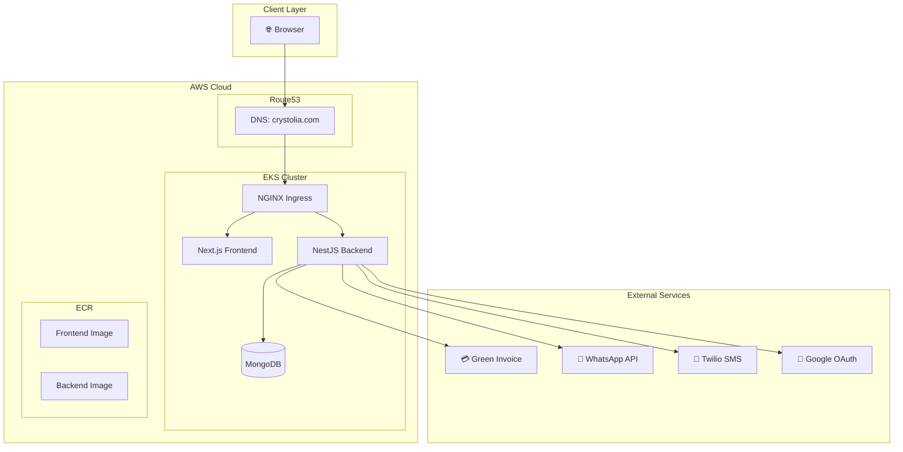

<h1 align="center">
  🌻 Crystolia DevOps Platform
</h1>

<p align="center">
  <strong>Enterprise-grade SaaS platform for order management, built with modern DevOps practices</strong>
</p>

<p align="center">
  
  
  
  
  
</p>

---

## 📋 Overview

Crystolia is a full-stack SaaS platform designed for managing business orders, customers, and invoices. The project demonstrates production-grade DevOps practices including:

- **Infrastructure as Code** with Terraform
- **Container Orchestration** with Kubernetes (EKS)
- **GitOps** with ArgoCD
- **CI/CD** with GitHub Actions
- **Monitoring** with Prometheus & Grafana

---

## 🏗️ Architecture



---

## 🛠️ Tech Stack

| Layer | Technology |
|-------|------------|
| **Frontend** | Next.js 16, TypeScript, Tailwind CSS, RTL Support |
| **Backend** | NestJS 11, Express, Mongoose, Passport.js |
| **Database** | MongoDB 6.0 |
| **Infrastructure** | AWS EKS, VPC, Route53, ECR |
| **IaC** | Terraform |
| **CI/CD** | GitHub Actions |
| **GitOps** | ArgoCD |
| **Monitoring** | Prometheus, Grafana |
| **Ingress** | NGINX Ingress Controller |
| **TLS** | cert-manager + Let's Encrypt |

---

## 🚀 Quick Start

### Prerequisites
- Docker & Docker Compose
- Node.js 20+
- AWS CLI (for production)
- kubectl & Helm (for K8s deployment)

### Local Development

```bash
# Clone the repository
git clone https://github.com/ShaiMullo/crystolia-devops-platform.git
cd crystolia-devops-platform

# Start all services
docker compose up --build

# Access the application
# Frontend: http://localhost:3000
# Backend:  http://localhost:4000/api/health
```

### Seed Demo Data

```bash
cd backend
npm run seed
```

**Default Users:**
| Role | Email | Password |
|------|-------|----------|
| Admin | admin@crystolia.com | admin |
| Customer | olive@restaurant.com | 123 |

---

## 📁 Project Structure

```
crystolia-devops-platform/
├── frontend/                 # Next.js frontend application
│   ├── app/                  # App router pages & components
│   ├── i18n/                 # Internationalization config
│   └── Dockerfile
├── backend/                  # NestJS backend API
│   ├── src/
│   │   ├── routes/           # API endpoints
│   │   ├── services/         # Business logic & integrations
│   │   ├── models/           # MongoDB schemas
│   │   └── config/           # Passport & auth config
│   └── Dockerfile
├── helm/                     # Kubernetes Helm charts
│   └── crystolia-chart/
│       ├── templates/        # K8s manifests
│       └── values.yaml       # Configuration
├── infra/                    # Terraform infrastructure
│   ├── main.tf               # Provider & backend
│   ├── eks.tf                # EKS cluster
│   ├── vpc.tf                # Networking
│   └── ecr.tf                # Container registry
├── argocd/                   # GitOps application definitions
├── .github/workflows/        # CI/CD pipelines
└── docker-compose.yml        # Local development
```

---

## 🔌 API Integrations

| Service | Purpose | Status |
|---------|---------|--------|
| **Green Invoice** | Automatic invoice generation | ✅ Implemented |
| **WhatsApp (Meta)** | Customer notifications | ✅ Implemented |
| **Twilio SMS** | Welcome messages | ✅ Implemented |
| **Google OAuth** | Social login | ✅ Implemented |
| **Meshulam** | Payment gateway | ⚠️ Mock only |

---

## ☁️ Production Deployment

### 1. Provision Infrastructure

```bash
cd infra
terraform init
terraform apply
```

### 2. Configure kubectl

```bash
aws eks update-kubeconfig --region us-east-1 --name crystolia-cluster
```

### 3. Install Dependencies

```bash
# NGINX Ingress
helm repo add ingress-nginx https://kubernetes.github.io/ingress-nginx
helm install ingress-nginx ingress-nginx/ingress-nginx -n ingress-nginx --create-namespace

# cert-manager
helm repo add jetstack https://charts.jetstack.io
helm install cert-manager jetstack/cert-manager -n cert-manager --create-namespace --set installCRDs=true
```

### 4. Deploy Application

```bash
helm upgrade --install crystolia ./helm/crystolia-chart -n crystolia --create-namespace
```

### 5. Configure DNS

Update your domain registrar's nameservers to point to Route53.

---

## 📊 Monitoring

Access Grafana dashboards after installing kube-prometheus-stack:

```bash
kubectl port-forward svc/prometheus-grafana 3001:80 -n monitoring
# Open: http://localhost:3001 (admin/prom-operator)
```

---

## 🔐 Environment Variables

### Backend

| Variable | Description |
|----------|-------------|
| `MONGO_URI` | MongoDB connection string |
| `JWT_SECRET` | JWT signing key |
| `GOOGLE_CLIENT_ID` | OAuth client ID |
| `GREEN_INVOICE_API_ID` | Invoice API credentials |
| `WHATSAPP_ACCESS_TOKEN` | Meta API token |
| `TWILIO_ACCOUNT_SID` | SMS credentials |

---

## 📜 License

MIT © Shai Mullo

---

<p align="center">
  Built with ❤️ using modern DevOps practices
</p>

