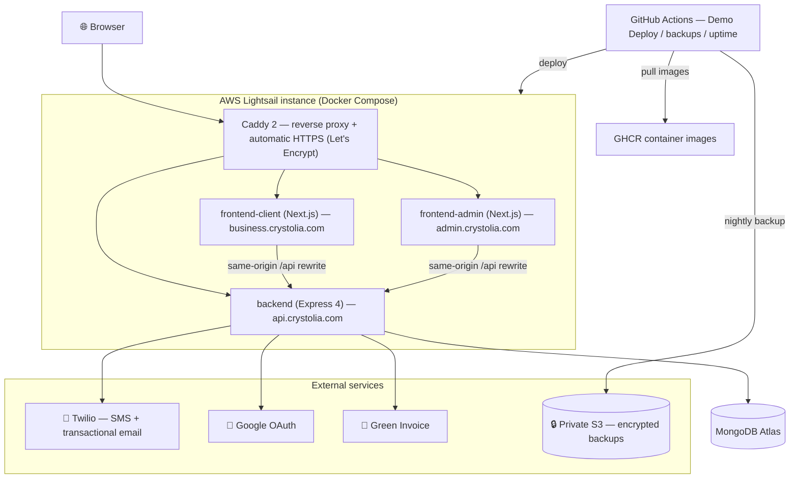

<h1 align="center">
  🌻 Crystolia
</h1>

<p align="center">
  <strong>B2B ordering platform for an edible-oil distributor — customer portal, admin CRM/ERP and REST API</strong>
</p>

<p align="center">
  
  
  
  
  
</p>

---

## 📋 Overview

Crystolia is a full-stack B2B platform through which business customers of an oil distributor register, get approved, place orders and track invoices and shipments, while staff manage the whole lifecycle from an admin CRM/ERP.

**Live production services:**

| Service | URL | Purpose |
|---------|-----|---------|
| Customer portal | https://business.crystolia.com | Registration, onboarding, orders, invoices, profile |
| Admin CRM/ERP | https://admin.crystolia.com | Leads, registrations, customers, products, inventory, orders, invoices, payments, shipments, system health |
| REST API | https://api.crystolia.com | Express backend (webhooks, lead ingestion, external access) |

The repository contains three deployable apps plus infrastructure:

- `backend/` — Express 4 + Mongoose 8 REST API (TypeScript, MongoDB Atlas)
- `frontend-client/` — Next.js 16 / React 19 customer portal (Hebrew/English/Russian, RTL support)
- `frontend-admin/` — Next.js 16 / React 19 admin CRM/ERP
- `terraform-cheap/`, `deploy/demo/`, `docker-compose.demo.yml` — the **active** single-server production infrastructure

> **Note on scope:** an EKS/Kubernetes/ArgoCD showcase also exists in this repo (`helm/`, `.github/workflows/production.yml`, `staging.yml`, `docs/deployment/`). It is an **optional/future enterprise track and is not the running production system**. See [Production architecture](#%EF%B8%8F-production-architecture).

---

## 🏗️ Production architecture

The real production system is deliberately simple and cheap: one AWS Lightsail instance running Docker Compose behind Caddy, with MongoDB Atlas as the managed database.


```mermaid
graph TB
    Browser[🌐 Browser]

    subgraph Lightsail["AWS Lightsail instance (Docker Compose)"]
        Caddy["Caddy 2 — reverse proxy + automatic HTTPS (Let's Encrypt)"]
        Client["frontend-client (Next.js) — business.crystolia.com"]
        Admin["frontend-admin (Next.js) — admin.crystolia.com"]
        API["backend (Express 4) — api.crystolia.com"]
    end

    Atlas[("MongoDB Atlas")]
    GHCR["GHCR container images"]
    GHA["GitHub Actions — Demo Deploy / backups / uptime"]

    subgraph External["External services"]
        Twilio["📲 Twilio — SMS + transactional email"]
        Google["🔐 Google OAuth"]
        GreenInvoice["🧾 Green Invoice"]
        S3[("🔒 Private S3 — encrypted backups")]
    end

    Browser --> Caddy
    Caddy --> Client
    Caddy --> Admin
    Caddy --> API
    Client -->|"same-origin /api rewrite"| API
    Admin -->|"same-origin /api rewrite"| API
    API --> Atlas
    API --> Twilio
    API --> Google
    API --> GreenInvoice
    GHA -->|deploy| Lightsail
    GHA -->|pull images| GHCR
    GHA -->|nightly backup| S3
```

Key properties:

- **Caddy** terminates TLS for all three domains and provisions/renews Let's Encrypt certificates automatically.
- Both frontends reach the API **same-origin** via a Next.js `/api` rewrite, so browser traffic never depends on CORS; `api.crystolia.com` exists for webhooks, the landing site's lead ingestion, and external integrations.
- Container images are built by GitHub Actions and pulled from **GHCR** (`ghcr.io/shaimullo/crystolia-*`).
- `terraform-cheap/` provisions the Lightsail instance, static IP and firewall (local state, ~$12/mo).

---

## 🛠️ Tech stack (actual)

| Layer | Technology |
|-------|------------|
| Customer portal / Admin | Next.js 16, React 19, TypeScript, Tailwind CSS 4, RTL support |
| Backend | Express 4, TypeScript, Mongoose 8, Passport (Google OAuth), JWT |
| Database | MongoDB Atlas (Mongoose 8) |
| Reverse proxy / TLS | Caddy 2 + Let's Encrypt |
| Hosting | AWS Lightsail (single instance, Docker Compose) |
| Images | GitHub Container Registry (GHCR) |
| CI/CD | GitHub Actions |
| Notifications | Twilio SMS + transactional email |
| Invoicing | Green Invoice API |
| Backups | GitHub Actions → encrypted archives in private S3 |
| Tests | Vitest + Supertest + mongodb-memory-server (backend) |

---

## 🔐 Authentication & registration

- **Session:** JWT stored in an **HttpOnly cookie** (`auth_token`, `SameSite=Lax`, `Secure` in production). The cookie is the single source of truth; the JWT is never stored in `localStorage`.
- **Login methods:** email/password (bcrypt-hashed) and **Google OAuth**. Google registrations copy the Google profile picture; customers can also upload their own profile image.
- **Admin approval gate:** new business registrations land in a *pending* state and **cannot log in or order until an admin approves them**. Google sign-ups go through a completion page (company details) before entering the same approval queue.
- **Password reset:** one-time **hashed** reset token with a **30-minute expiry**.
- **Session invalidation:** tokens carry a `tokenVersion`; bumping it server-side invalidates outstanding sessions.

## 🧲 Lead flow

The public landing site posts leads to the API; leads are **persisted** in MongoDB and trigger an **SMS notification** to the admin. Admins work leads from the CRM (timeline, status, conversion to customer).

## 🛒 Ordering & pricing security

- Order prices are computed **exclusively on the backend** from authoritative SKU pricing (business settings). **Client-supplied product names and prices are ignored** — a tampered request cannot change what is charged.
- Approval-flow customers are **gated from ordering** until delivery + billing details are complete (enforced server-side with `403 ORDER_PROFILE_INCOMPLETE`, mirrored in the UI).
- Every order keeps an auditable **timeline** (created, items updated, status changes, notification outcomes).

## 📦 Inventory, invoices, payments, shipments

- **Inventory:** stock levels with movement history (adjustments, reservations against orders).
- **Invoices:** created as drafts in the admin console; issuing a draft calls the **Green Invoice** API and stores the returned `pdfUrl` (visible to both admin and the owning customer). Requires `GREEN_INVOICE_API_ID`/`GREEN_INVOICE_SECRET`; sandbox mode is the default.
- **Payments:** recorded **manually** against invoices (bank transfer, cash, check, etc.) with partial-payment support and derived invoice payment status. **Online card checkout is NOT enabled** — there is no payment gateway in the running system; `credit_card` is only a bookkeeping label.
- **Shipments:** created per order; marking a shipment delivered completes the order automatically.
- **Comax ERP is NOT connected.** `backend/src/integrations/comax/` is a deliberate stub behind a generic ERP-connector seam — no base URL, no credentials, and the connector is intentionally never registered. The admin Comax screen renders mock data only.

## 📣 Notifications

Twilio SMS and transactional email notify the admin of new orders/registrations and notify customers of order-status changes. Notification outcomes (`sent`/`failed`) are recorded on the order timeline; provider errors are sanitized and never exposed to clients.

---

## 🚀 Quick start (local development)

### Prerequisites

- Docker & Docker Compose
- Node.js 20+
- GNU Make

```bash
git clone https://github.com/ShaiMullo/crystolia-app.git
cd crystolia-app

# Start everything (MongoDB + backend + both frontends)
make up

# Follow logs
make logs
```

**Services:**

| Service | URL |
|---------|-----|
| Customer portal | http://localhost:3000 |
| Admin CRM/ERP | http://localhost:3001 |
| Backend API | http://localhost:4000 |
| MongoDB | localhost:27017 |

**Makefile commands:**

```bash
make dev      # Start (foreground, logs visible)
make up       # Start (detached)
make down     # Stop all services
make logs     # Follow all logs
make clean    # Stop + delete database volumes (prompts)
make rebuild  # Rebuild Docker images without cache
```

**Health endpoints (backend):**

- `GET /health` — lightweight liveness (no DB dependency)
- `GET /api/health` — overall health including DB status
- `GET /api/ready` — readiness (503 until the database is connected)
- `GET /api/live` — liveness probe

**Backend scripts** (run inside `backend/`):

```bash
npm test           # Vitest suite (Supertest + in-memory MongoDB)
npm run typecheck  # tsc --noEmit
npm run lint       # eslint
npm run seed:demo  # Development-only demo dataset (refuses to run outside development)
```

---

## 🔄 CI/CD

| Workflow | Trigger | Purpose |
|----------|---------|---------|
| `ci.yml` | push/PR to `main` | Quality gate: change detection, then backend typecheck + tests, admin typecheck + lint + build, client lint + build. No secrets. |
| `demo-deploy.yml` | manual (`workflow_dispatch`) | **The production deploy path**: verify → build & push GHCR images → temporarily open the Lightsail firewall for the runner → SSH deploy via `deploy/demo/remote-deploy.sh` → health check → close firewall. |
| `database-backup.yml` | nightly (02:30 UTC) + manual | Encrypted backup **with automatic restore test** (details below). |
| `uptime-monitor.yml` | every 5 minutes | External uptime checks against all three production URLs with retries. |
| `backend-lock-verify.yml` | PRs touching `backend/**` | Lockfile integrity check. |
| `production.yml` / `staging.yml` | tags / push | **EKS-era showcase pipelines (ECR/GitOps) — not part of the active system.** |

### Backups & disaster recovery

The nightly `database-backup.yml` job:

1. Opens the Lightsail firewall **only for the runner's IP**, SSHes in, and runs `mongodump` against the live `MONGO_URI` (read from the running backend container).
2. Verifies archive integrity (`gzip -t`) and records a SHA-256 checksum.
3. **Restore-tests the archive** into an isolated MongoDB container and asserts collections were actually restored.
4. Uploads archive + checksum to a **private S3 bucket with server-side encryption (AES-256)**; retention 35 days.
5. Always closes the temporary firewall opening, even on failure.

### Uptime monitoring

`uptime-monitor.yml` polls the API health endpoint, the admin login page and the customer portal every 5 minutes and fails loudly (with retries) if any of them stops responding with expected content.

---

## 🛡️ Security decisions

- HttpOnly, SameSite=Lax JWT cookie — no tokens in `localStorage`; same-origin `/api` rewrites avoid CORS exposure.
- bcrypt password hashing; one-time hashed password-reset tokens (30-min expiry).
- Admin approval gate for all new business accounts.
- **Server-side pricing** — order totals cannot be influenced by the client.
- Role-based route guards (`customer` / `agent` / `admin`); customers can only ever read their own company's invoices and orders.
- helmet, rate limiting, and centralized error handling on the API.
- Provider (Twilio/Green Invoice) errors are sanitized before logging/storage; secrets live only in environment variables and GitHub Secrets.
- SSH to the production box is firewalled shut; CI opens it per-run for a single runner IP and closes it after.

---

## ☁️ Production deployment flow

1. (Once) Provision the Lightsail instance with `terraform-cheap/` (instance, static IP, firewall, optional Route53 records).
2. Configure GitHub secrets (`DEMO_SSH_*`, AWS credentials) and repo variables (domains, instance name).
3. Run the **Demo Deploy** workflow (Actions → *Demo Deploy* → choose a git ref). It builds the three images, pushes them to GHCR, and deploys `docker-compose.demo.yml` + `deploy/demo/Caddyfile` to the server over SSH.
4. Caddy handles TLS automatically; the workflow ends with a health check.

The `helm/` chart and the ECR/ArgoCD pipelines remain available as an **optional enterprise deployment showcase** (EKS, NGINX Ingress, cert-manager, HPA/PDB) but are not provisioned and are not used by the live system.

---

## 📁 Project structure

```
crystolia-app/
├── backend/                  # Express 4 + Mongoose 8 API (TypeScript)
│   └── src/
│       ├── routes/           # auth, orders, invoices, leads, crm* …
│       ├── models/           # ~25 Mongoose models (Order, Invoice, Lead, …)
│       ├── services/         # pricing, notifications, Green Invoice, backups
│       ├── integrations/     # generic ERP seam (Comax = inert stub)
│       ├── middleware/       # auth (JWT cookie), RBAC, error handler
│       └── test/             # Vitest + Supertest + in-memory MongoDB
├── frontend-client/          # Next.js 16 customer portal (he/en/ru)
├── frontend-admin/           # Next.js 16 admin CRM/ERP (he/en/ru)
├── landing/                  # Marketing/landing site
├── deploy/demo/              # Caddyfile + remote-deploy.sh (active production)
├── docker-compose.demo.yml   # Active production compose (Caddy + 3 apps)
├── docker-compose*.yml       # Local development variants
├── terraform-cheap/          # Lightsail IaC (active production infra)
├── helm/                     # EKS showcase chart (NOT active)
├── .github/workflows/        # CI, Demo Deploy, backups, uptime, EKS showcase
└── docs/                     # Runbooks, audits, architecture (see below)
```

Documentation map:

- `docs/DEMO_RUNBOOK.md` — presentation/demo runbook
- `docs/EXAMINER_TECHNICAL_BRIEF.md` — technical brief (architecture, ERD, tradeoffs)
- `docs/security-audit.md` — current security audit (accurate)
- `docs/deployment-cheap/` — Lightsail deployment guides (active path)
- `docs/SYSTEM_AUDIT.md`, `docs/project_map.md`, `docs/REPO_STRUCTURE_REPORT.md`, `docs/architecture/` — **archived / historical** (describe an earlier NestJS/EKS plan; banners at the top of each file point here)

---

## 🔌 Integration status (honest)

| Service | Purpose | Status |
|---------|---------|--------|
| Google OAuth | Social login + registration completion | ✅ Active |
| Twilio | SMS + transactional email notifications | ✅ Active |
| Green Invoice | Invoice issuing → PDF | ✅ Implemented (env-gated; sandbox by default) |
| WhatsApp | Order notifications | ⚙️ Present in code, env-gated; not part of the primary flow |
| Comax ERP | Inventory/orders sync | ❌ **Not connected** — inert stub, no credentials, never registered |
| Online card checkout | Customer payments | ❌ **Not enabled** — payments are recorded manually by staff |

---

## 📜 License

MIT © Shai Mullo
