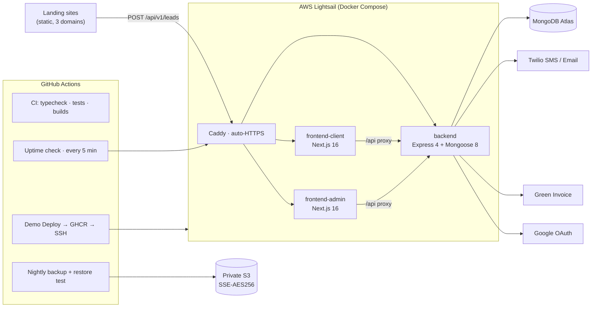
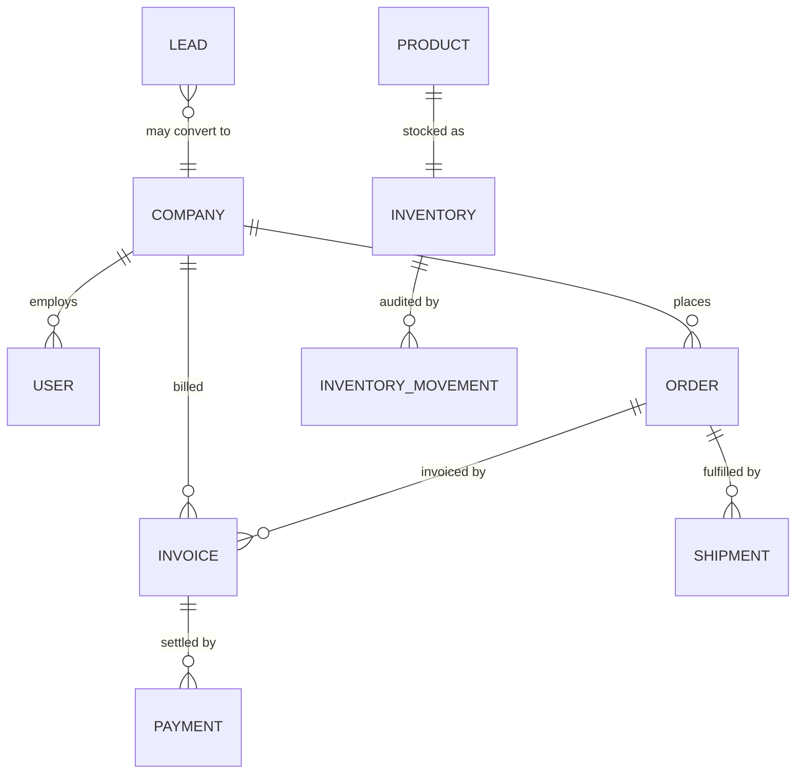
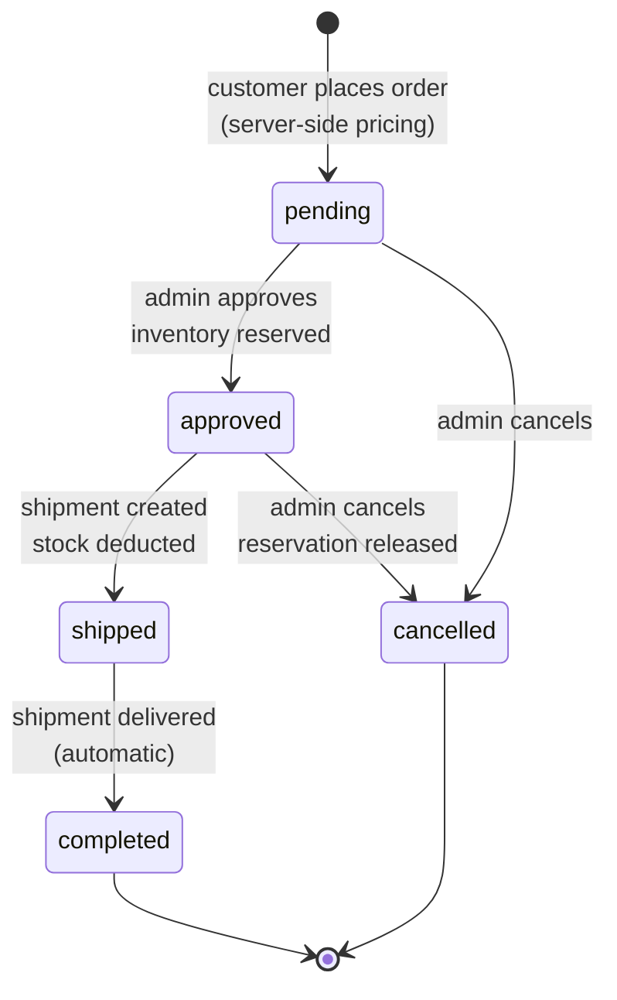

# Crystolia — Technical Brief for Examiners

A concise engineering overview of the Crystolia B2B platform as deployed in production.
Companion documents: [`DEMO_RUNBOOK.md`](./DEMO_RUNBOOK.md) (presentation script) and the root
[`README.md`](../README.md) (setup and operations).

## 1. Business problem

Crystolia is an edible-oil distributor selling to businesses (restaurants, shops, importers).
Before this system, the funnel ran over phone calls and WhatsApp: leads were lost, prices were
negotiated ad-hoc, and invoicing/shipment tracking lived in spreadsheets. The platform digitizes
the full order-to-cash flow: **lead capture → vetted business registration → self-service
ordering → back-office approval, invoicing, payment recording, and shipment tracking** — with
an auditable trail for every step.

## 2. Users and roles

| Role | Surface | Capabilities |
|---|---|---|
| Visitor / lead | Landing sites (crystolia.com / .co.il / .ru) | Submit a contact-form lead |
| Customer | business.crystolia.com | Register (pending approval), complete onboarding, place orders, view own orders/invoices/PDFs, manage profile & avatar |
| Agent | admin.crystolia.com | Operational CRM subset (orders, invoices) |
| Admin | admin.crystolia.com | Everything: approvals, users, CRM/ERP, inventory, payments, shipments, system health, backups |

## 3. Architecture

- **Backend API** — Express 4 + Mongoose 8, TypeScript, MongoDB Atlas. Single service exposing
  `/api/v1/*` for auth, leads, orders, invoices, payments, shipments, inventory, CRM.
- **Customer portal** — Next.js 16 / React 19 / Tailwind, same-origin `/api` rewrite proxy to
  the backend (keeps SameSite=Lax cookies working).
- **Admin console** — Next.js 16 / React 19, separate app with edge middleware JWT verification.
- **Production** — one AWS Lightsail instance running Docker Compose behind **Caddy**
  (automatic HTTPS/Let's Encrypt). Images built in CI and pulled from **GHCR**.
- **External services** — Twilio (SMS + transactional email), Green Invoice (invoice PDFs),
  Google OAuth, AWS S3 (encrypted backups).

A parallel **EKS/Helm/Terraform showcase** exists in the repo (`helm/`, EKS-era workflows) but
is **not** the production path — production is the Lightsail stack above.

## 4. Data model (core entities)

User, Company, Customer (CRM view), Lead, Product, Inventory + InventoryMovement, Order
(with an **embedded timeline** of audit events), Invoice, Payment, Shipment, Supplier,
PurchaseOrder, AuditLog, Settings.

Every order carries a `timeline[]` of typed events (`order_created`, `status_changed`,
`order_items_updated`, `admin_order_notification`, `customer_order_notification`) with raw
metadata preserved for auditing; the UI renders them as translated sentences, never raw JSON.

## 5. Security model

- **Session**: JWT in an **HttpOnly, SameSite=Lax cookie** (`auth_token`) — never in
  localStorage. A `tokenVersion` claim allows server-side session invalidation.
- **Authorization**: role guard (`customer` / `agent` / `admin`) on every protected route;
  company scoping forces customers to see **only their own company's** orders and invoices
  (covered by tests).
- **Registration gate**: new businesses are `pending` until an admin approves them; login is
  refused before approval.
- **Password reset**: single-use token stored **hashed**, 30-minute expiry.
- **Transport & headers**: HTTPS everywhere (Caddy/Let's Encrypt), helmet, CORS allow-list,
  rate limiting on the API.
- **Secrets**: environment variables / GitHub Actions secrets only — none in the repo.

## 6. Critical business rules

1. Registration requires admin approval before first login.
2. Ordering is blocked until the billing/delivery profile is complete (server-enforced 403).
3. **Server-side pricing**: order totals are computed exclusively by the backend from
   authoritative SKU pricing. Client-supplied product names and prices are untrusted and
   ignored — a regression test submits a tampered price and asserts the total is unaffected.
4. A draft invoice has **no PDF**; only issuing via Green Invoice produces a real `pdfUrl`.
   The UI never fakes an issued state.
5. Payments are **manual business records** (bank transfer / cash / check) posted by admins
   against invoices, with partial-payment support; no online card checkout exists.
6. Marking a shipment delivered automatically completes its order (recorded in the timeline).
7. Approving an order **reserves inventory**; shipping deducts it; cancelling releases it.

## 7. Notification failure handling

SMS/email are **best-effort**: a provider outage never fails the business operation. Provider
errors are sanitized at the service layer (no raw Twilio payloads propagate); the timeline
stores only coarse `sent`/`failed` flags per channel, which the admin UI renders as translated,
professional warnings ("Customer update sent by email; SMS delivery failed").

## 8. CI/CD

- **`ci.yml`** — on every push/PR: path-filtered jobs run backend typecheck + vitest suite
  (60+ tests), and typecheck/lint/build for both frontends.
- **`demo-deploy.yml`** — manual dispatch: builds images, pushes to GHCR, then deploys to
  Lightsail over SSH (the runner's IP is allowed through the firewall only for the run).
- **`backend-lock-verify.yml`** — PR guard for lockfile integrity.
- EKS-era `production.yml`/`staging.yml` remain as the enterprise showcase, unused in production.

## 9. Backup & disaster recovery

Nightly (02:30 UTC) GitHub Actions job: `mongodump` streamed from the production container
(the Mongo URI is read from the running service, never stored in CI), gzip archive +
SHA-256 checksum, then a **full automated restore test** into an isolated MongoDB container
(fails the run unless collections restore), then upload to a **private S3 bucket with
server-side encryption (AES-256)**; 35-day retention. Firewall access for the runner is
opened per-run and always closed again. Uptime is checked **every 5 minutes** against the
API health endpoint, admin console, and business portal, with retries before alerting.

## 10. Engineering tradeoffs

| Decision | Rationale |
|---|---|
| Single Lightsail box + Compose vs Kubernetes | ~$12/mo, one moving part, minutes-level MTTR via redeploy; EKS kept as a separate showcase, not production complexity |
| Express monolith vs microservices | One team, one domain; module boundaries live in `routes/`/`services/` instead of network boundaries |
| Embedded order timeline vs event store | Atomic writes with the order, trivially queryable; sufficient at current audit granularity |
| Manual payments vs gateway integration | Matches how this business actually collects (bank transfer); avoids PCI scope before product-market fit |
| Cookie JWT vs header tokens | HttpOnly + SameSite=Lax removes XSS token theft; same-origin proxies keep it simple |

## 11. Known limitations

- No online card checkout (deliberate — see above).
- **Comax ERP is not connected**: a documented stub exists behind a generic ERP-connector
  seam, intentionally unregistered until a go-live decision.
- Single-server availability (no HA); mitigated by backups + uptime monitoring + fast redeploy.
- No automated frontend test suite (backend has the test coverage).
- Green Invoice runs in sandbox unless production credentials are configured.

## 12. Roadmap

1. Comax ERP integration through the existing connector seam (sync products/inventory/invoices).
2. Payment gateway for online checkout once business volume justifies PCI scope.
3. EKS deployment path (Helm chart already exists) as the scale-up story.
4. Frontend test coverage (Playwright) and expanded backend integration tests.

## 13. Order lifecycle

Invoicing runs alongside: `draft → issued (Green Invoice PDF) → paid` (via manual payment
records; `partial`/`overdue` tracked on the invoice), with `cancelled` available at any point.
